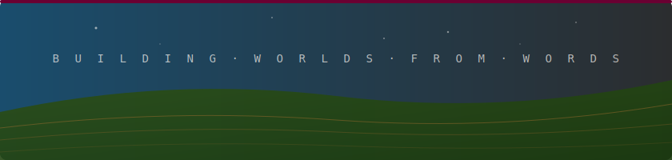

<!-- HEADER BANNER -->
<div align="center">



</div>

---

### Hey — I'm Dave.

I build tools that turn prompts into production software. My work sits at the intersection of **AI-assisted development**, **infrastructure automation**, and **developer experience**.

Think of it like geological layers: creation at the base, infrastructure on top, then iteration, deployment, monetization, and operations — each one stacking to reduce friction between *idea* and *shipped product*.

#### 🤝 Collaborations

Contributor to [**Guideboard Labs**](https://github.com/GuideboardLabs) — a workshop building local-first AI infrastructure. My [`repo-review`](https://github.com/TheEditor/repo-review) series serves as their official project auditor, and I've contributed to [Oathweaver](https://github.com/GuideboardLabs/oathweaver), their hardened local-only AI workbench.

---

#### 🔧 What I'm Building

A full ecosystem for **vibe coding** — going from natural language to deployed app with minimal friction. Current focus areas:

- **Repo Review** — A series of prompts for producing deep, taste-oriented analyses of codebases..


#### 🛠 Stack & Tools

```
Languages    Go · TypeScript · Python
Frameworks   Next.js · React · Tailwind
Infra        Netlify · Supabase · Vercel
AI           Claude · vibe coding workflows
```

#### 📌 Pinned Work

| Repo | What it does |
|------|-------------|
| [`misc_coding_agent_tips_and_scripts`](https://github.com/TheEditor/misc_coding_agent_tips_and_scripts) | Practical patterns for AI-assisted dev |
| [`repo-review`](https://github.com/TheEditor/repo-review) | Not code reviews. Taste reviews. |

---

<div align="center">


<br/>
<sub>In memory of Murphy 🐾</sub>
<br/><br/>
<sub>Michigan · building digital earth, one layer at a time</sub>

</div>
